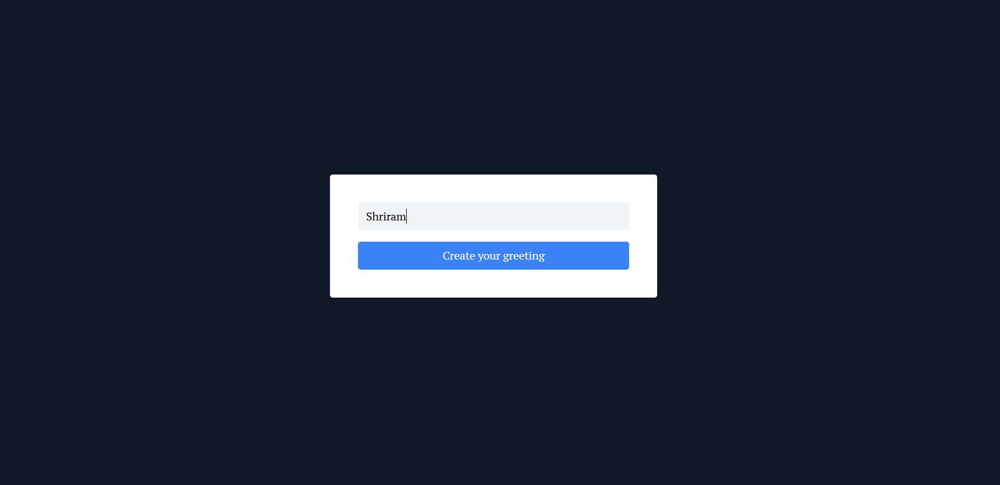
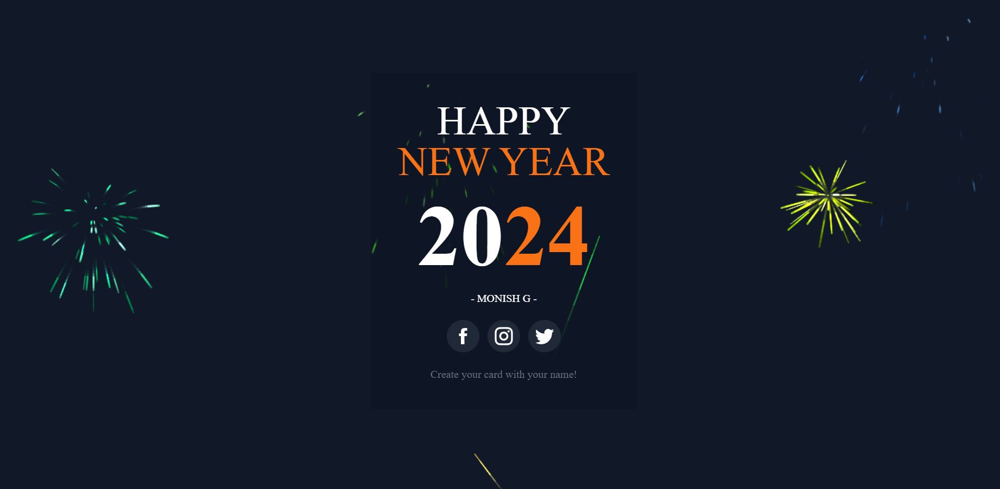

# Festival greeting app

This is an eLearning website where users can add courses, view or download courses. It is built using HTML, JavaScript, JavaScript DOM manipulation, and Tailwind CSS. The project is bundled using Vite.


## Table of Contents
- [Screenshots](#screenshots)
- [Live-Link](#live-link)
- [Installation](#installation)
- [Usage](#usage)
- [Features](#features)
- [License](#license)

## Screenshots
- **ScreenShot 1**
  
- **ScreenShot 2**  
  


## Live-Link
[https://san1234100.github.io/festival-greeting-app/](https://san1234100.github.io/festival-greeting-app/)
## Installation

1. Clone the repository:

```bash
git clone https://github.com/san1234100/festival-greeting-app.git
```
2. Navigate into the project directory:
```bash
cd festival-greeting-app
```

3. Install dependencies using npm or yarn:
```bash
npm install
```

4. Start the development server:
```bash
npm run dev
```


## Usage
 
- Enter your name in the input field and click the "Generate" button to see the New Year wish card with fireworks animations.

## Features
- Generates personalized New Year wish cards
- Displays fireworks animations for a festive touch
- Simple and intuitive user interface


# Happy coding!😁🧑‍💻